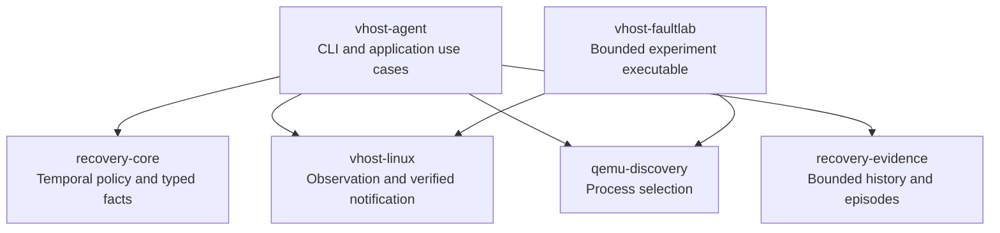

# Modular recovery architecture proposal

Status: **Reviewed design baseline**. The implementation candidate and measured limits are recorded in [implementation review](../implementation-review.md). Date: 2026-10-09. Tracking: TASK-12. Revision 2 incorporates the owner's component-isolation and pre-production guidance.

The recovery functionality should be rebuilt around independently releasable libraries and explicit application use cases. The existing draft PR stack supplies useful algorithms, tests and evidence. It is not a compatibility specification or the implementation foundation to merge. The principal change is ownership: recovery policy owns decisions over time; a Linux backend owns process and queue capabilities and every verified write; evidence processing owns diagnostic episodes; the application composes these pieces.

The recommendation is a multi-module Go workspace in one repository initially, with six meaningful release units described below. Each library must work without the recovery executable, and every module must build against declared dependencies outside the workspace. Individual packages within a module remain private implementation details where they have no independent purpose. Repository separation can follow without a runtime redesign.

The owner requires clean dependency boundaries both between components and inside their implementations, and delegates engineering tradeoffs to the designer. There is no formal production deployment except a manual recovery-once wrapper in an external CLI that can be changed. The decisions below therefore optimize the new design rather than preserving unreleased interfaces. This revision records the design-stage decisions. Implementation began after owner approval; the linked implementation review records the resulting source and validation. Deployment and release publication remain separate.

## Review scope and source revisions

The following open draft PR heads were read from GitHub on 2026-10-09. The cumulative source review uses the exact archive of PR 6. The local main checkout contains earlier uncommitted work and is not the review baseline.

| PR | Scope | Head |
| --- | --- | --- |
| [2](https://github.com/yckao/virtio-net-recovery/pull/2) | Recovery baseline and CI | `d964f949e3ae889b89349da95c8a97672092c4fd` |
| [3](https://github.com/yckao/virtio-net-recovery/pull/3) | Observe, recover, kick and trace | `06c1b38a4f97c4b193cc8ec5ccf7e1ef0a0b8e53` |
| [4](https://github.com/yckao/virtio-net-recovery/pull/4) | Episode model | `11d355fcbb0fed60f3f1881546934e94058064da` |
| [5](https://github.com/yckao/virtio-net-recovery/pull/5) | Journal integration | `1f5b7c4533194ee798a84f90aad0a6ca7bcb3df0` |
| [6](https://github.com/yckao/virtio-net-recovery/pull/6) | Metrics and validation documentation | `3146e10245e2b92bc022c134648c6fc43d858fa5` |

At this head, `internal/watch` contains 15 production Go files and 2,635 lines, plus 17 test files and 2,863 test lines, counting comments and blanks. Size alone is not the objection: all these files share one unrestricted package boundary. CI success and the historical validation report address behavior under tested conditions; they do not establish architecture quality or qualify the replacement.

## Architectural findings

These are maintainability and ownership findings. They do not imply that each area contains a demonstrated runtime defect.

| Finding and source | Consequence | Replacement rule |
| --- | --- | --- |
| [`runRecover`](https://github.com/yckao/virtio-net-recovery/blob/3146e10245e2b92bc022c134648c6fc43d858fa5/internal/watch/recover_linux.go#L120-L416) combines inventory replacement, pacing, observation, Linux resources, journaling, metrics, summaries and cleanup. | A policy change requires understanding resource cleanup and several reporting protocols. | One worker coordinates typed collaborators; each collaborator owns its own state. |
| [`Snapshot`](https://github.com/yckao/virtio-net-recovery/blob/3146e10245e2b92bc022c134648c6fc43d858fa5/internal/watch/model.go#L8-L35) is simultaneously the BPF wire layout, kernel identity and validation model. | A transport-field change can affect identity equality and domain consumers. | Private generated wire types, explicit private attachment identity, public opaque queue handles, and semantic observations are separate types. |
| [`Config`](https://github.com/yckao/virtio-net-recovery/blob/3146e10245e2b92bc022c134648c6fc43d858fa5/internal/watch/run_linux.go#L19-L28) carries options, PID, identity callback and concrete telemetry. The [CLI](https://github.com/yckao/virtio-net-recovery/blob/3146e10245e2b92bc022c134648c6fc43d858fa5/cmd/vhost-watch/main_linux.go#L104-L108) sets a fake PID to validate options. | User configuration and acquired runtime capabilities have no clear boundary. | Validate immutable options first; acquire mandatory generation-bound resources afterward. |
| [`recoveryQueue.clock`](https://github.com/yckao/virtio-net-recovery/blob/3146e10245e2b92bc022c134648c6fc43d858fa5/internal/watch/recover_linux.go#L59-L64) takes recovery time from the journal. Live decisions and write baselines use it. | Diagnostics provide a dependency needed by policy. | The application supplies monotonic time explicitly to both policy and evidence processing. |
| [Live decisions](https://github.com/yckao/virtio-net-recovery/blob/3146e10245e2b92bc022c134648c6fc43d858fa5/internal/watch/recover_linux.go#L442-L456) return diagnostic enums; [metrics](https://github.com/yckao/virtio-net-recovery/blob/3146e10245e2b92bc022c134648c6fc43d858fa5/internal/watch/metrics.go#L147-L170) interprets journal strings and `map[string]any`. | Renaming an output field can silently affect accounting. | Typed facts have an explicit owner; JSON and Prometheus are projections of those facts. |
| [Journal callbacks](https://github.com/yckao/virtio-net-recovery/blob/3146e10245e2b92bc022c134648c6fc43d858fa5/internal/watch/recover_linux.go#L28-L37) synchronously reach [JSON encoding](https://github.com/yckao/virtio-net-recovery/blob/3146e10245e2b92bc022c134648c6fc43d858fa5/internal/watch/run_linux.go#L74-L92), behind a [fleet-wide writer mutex](https://github.com/yckao/virtio-net-recovery/blob/3146e10245e2b92bc022c134648c6fc43d858fa5/internal/watch/manager_linux.go#L26-L35). | A blocked output writer can stall workers and their shutdown. Episode memory bounds do not bound output latency. | Bounded output admission and explicit failure handling belong to the application transport. |
| [`RekickContext`](https://github.com/yckao/virtio-net-recovery/blob/3146e10245e2b92bc022c134648c6fc43d858fa5/internal/watch/target_linux.go#L214-L266) relies on fresh resources and prerequisites assembled by its callers. | Extracting this function alone exports an unsafe assembly protocol. | A backend operation obtains, validates, pins and writes its own resources. |
| The [fault controller](https://github.com/yckao/virtio-net-recovery/blob/3146e10245e2b92bc022c134648c6fc43d858fa5/internal/fault/run_linux.go#L173-L225) imports recovery internals and manipulates raw snapshot fields. | The experiment tool cannot evolve or ship independently. | Share a supported Linux backend and a narrow experimental bridge, never application internals. |
| [Snapshot and trace resource cleanup](https://github.com/yckao/virtio-net-recovery/blob/3146e10245e2b92bc022c134648c6fc43d858fa5/internal/watch/bpf_linux.go#L91-L136) leaks into worker logic. | Callers must understand BPF map identity and retirement rules. | The backend owns registration, serialized snapshot access, leases and cleanup. |

Several existing choices are worth retaining: pidfd identity, pinned duplicates, nonblocking eventfd checks, conservative supported-ring validation, a common recovery cadence, bounded diagnostic history, fixed metrics labels and tests separating accepted writes from observed progress. The replacement moves these mechanisms into coherent contracts rather than discarding them.

## Module boundaries and dependencies

Arrows below mean compile-time dependencies. The Linux backend and recovery policy do not depend on each other. The agent translates their small semantic types at its adapter boundary.



| Release unit | Owns | Explicitly excludes | Independent consumer and proof |
| --- | --- | --- | --- |
| `recovery-core` | Split-ring candidate timing, per-slot attempt pacing, per-generation verification, typed recovery facts | Linux, BPF, filesystem, timers, JSON, metrics, episode IDs, goroutines | A deterministic replay/simulation program can feed samples and obtain decisions without a host. |
| `vhost-linux` | Process sessions, queue handles, ring reads, final notification guards, BPF ABI/assets, optional trace sessions | Recovery cadence, domain regex, episodes, JSON, HTTP, application workers | A standalone queue inspector and manual notifier can use its public API. |
| `qemu-discovery` | Explicit PID and libvirt-runtime selection, deduplication, generation observations and selection problems | Opening pidfds, BPF, eventfd writes, recovery retries | Both executables and a process inventory command use it without importing each other. |
| `recovery-evidence` | Bounded sample history and diagnostic episode transitions through its own value contracts | Core/backend/discovery imports, recovery decisions, verification policy, metrics, JSON, HTTP, I/O and scheduling | A standalone program feeds evidence-owned sample/action fixtures and obtains episode records without any sibling module. |
| `vhost-agent` | Option parsing, use cases, scheduling, narrow translation adapters, locks, independent output and metrics adapters, HTTP lifecycle and exit policy | Raw BPF layouts, pointer identities, hand-built eventfd sequences, duplicate recovery rules | A separately versioned executable/image composes supported library versions; its internal packages also obey explicit dependency rules. |
| `vhost-faultlab` | Module build/load/unload, bounded experiment state, restoration policy and experimental kernel assets | Imports of agent internals, production metrics server, autonomous production recovery | A separately versioned experiment executable/image, with its own kernel matrix and disposable-kernel tests. |

`qemu-discovery` is small, but it has two real independent consumers and a distinct dependency contract. Keep it one small library. Do not create separate releases for clocks, FD utilities, enums, locks, or each adapter. Trace remains an optional capability in `vhost-linux` because attachment identity, probe compatibility and cleanup must evolve together.

The six units are not six services. The production agent remains one process; fault experiments remain a separate executable. No RPC, plugin loader, dependency-injection framework, universal event bus, repository abstraction, or shared `common` module is needed.

## Mandatory component knowledge rule

**A component may know only its explicitly declared direct dependencies, and only their supported public contracts. It must not know a nondependency exists or depend on another component's implementation.** This applies to packages within a release unit as well as to the six modules. A shared repository or a single Go package does not waive the rule.

Dependency means more than an import. Leaking a sibling's concrete type through a callback, aliasing its DTO, interpreting its private string fields, reading its files, calling it through a global registry, or using reflection/linker tricks is still coupling. Receiving a narrow consumer-owned port does not permit knowledge of the concrete provider. Public APIs must not force consumers to reach through a dependency into a third component's private state. Do not hide services in `context.Value`, start resources in `init`, or use mutable package singletons. Constructors receive explicit dependencies and instances own them.

| Boundary | Permitted knowledge | Forbidden knowledge |
| --- | --- | --- |
| `recovery-core` | Its own policy values and approved standard library | Evidence, exporter, backend, CLI, logger or their types/names/configuration |
| `vhost-linux` | Its own Linux contracts and declared OS/BPF libraries | Core cadence/state, evidence episodes, discovery implementation or application workflow |
| `qemu-discovery` | Its own selection contracts and process-data formats | Backend sessions, recovery or telemetry |
| `recovery-evidence` | Its own inputs, records, internal episode/history dependencies and approved standard library | Core facts/enums, Linux handles, PID discovery, logger/exporter behavior or their configuration |
| A translation adapter | Public contracts of its explicitly named source and destination | Either component's private state, scheduling rules or mutable internals |
| Application use case | Its own ports, core policy and runtime values | Concrete exporters, BPF collections or another use case's mutable state |
| Metrics and JSON adapters | Their own input/output contracts and explicitly declared encoding libraries | Each other's implementation, parsing each other's output, core/evidence internals |

The composition root wires dependencies. Separate small translators map backend-to-core, core-to-evidence and reporting values; there is no universal translator or application-wide context passed to every component. A receiver owns its input schema. Small explicit value conversions are an accepted cost; introducing a global contracts module or type aliases to remove those conversions would couple unrelated release units again. Inputs contain domain facts, not instructions named after their producer.

Each package records an import allowlist and a short contract covering responsibility, owned state, direct dependencies, valid inputs, outcomes, lifetime and error handling. Core rules remain private behind transitions; resource handles remain private behind operations. Split code where state ownership or reasons to change differ, not at an arbitrary file-length threshold. Avoid one interface per struct, generic strategy registries, redundant delegation layers and miscellaneous utility packages.

Implementation acceptance requires:

1. Import-graph checks for production, generated and test packages on supported build tags/platforms, including rejection of cycles and unlisted edges. Inspect exported reachable types with `go/types`, including aliases, embedding, callbacks and generic constraints; do not hide foreign objects in `any` payloads. No reflection, `go:linkname`, service locator, side-channel files or private-layout decoding to bypass these checks.
2. An external consumer and black-box contract tests for each public component using its own values and consumer-owned fakes. Integration tests live at the composition boundary and may name the participating dependencies; unit tests must not instantiate unrelated real components.
3. Private helper tests may exercise a local algorithm, but a public contract must be verifiable without patching private fields, package globals or clocks owned by another component.
4. A change-confinement check: replacing an implementation while keeping its public contract unchanged requires no changes to nonconsumers. Changing JSON or metrics cannot change core/backend/evidence; replacing evidence cannot change recovery effects or Linux operations.
5. State ownership, aliasing and concurrent access reviewed explicitly. Immutable returned records do not retain mutable ring storage; dependencies cannot mutate caller state through retained slices or callbacks.
6. A newly needed dependency is documented with its reason and tests before introducing the edge. A compile-time import check alone cannot prove conceptual independence; reviewers inspect public types, data interpretation and test fixtures as well.

## Public contracts

The following signatures illustrate responsibility and data flow; they are proposed contracts, not an implemented SDK. Final names can change during API review without changing the dependency rules.

### Recovery policy

```go
// recovery-core: value inputs and outputs; caller owns serialization and time.
func Step(state State, input Input) Transition

type Transition struct {
    State   State
    Effects []Effect // bounded per input; requests for the application
    Facts   []Fact   // typed observations, decisions and accepted outcomes
}
```

`State` has private fields and is created through a validated constructor for one slot. `Input` is a closed tagged set: cached observation, unavailable observation, live-check result, attempt result, time advance, generation replacement and stop. Constructors reject invalid combinations. `Effect` requests a live read or a conditional attempt; it cannot carry an OS descriptor or perform a write. `Fact` uses typed reasons and outcomes rather than diagnostic strings. Inputs, effects and results carry their expected slot/attachment generation. No arbitrary callbacks run inside `Step`. Each input has a documented maximum number of facts/effects; implementations must not grow histories inside transition results.

Time is an explicit monotonic duration from a run epoch. Wall time is added only to presentation records. Negative or backward time is rejected. Backend observation/write timestamps use a consistent userspace monotonic clock, converted at the adapter using the run epoch; raw BPF timestamps remain separate unless their clock relationship is established. The core uses 16-bit modular ring arithmetic with explicit geometry bounds and never treats an invalid sample as progress. An unchanged index cannot exclude a full wrap between samples.

There are three distinct identities:

| Identity | Owner and lifetime |
| --- | --- |
| Process generation | Backend validates PID namespace, PID and start generation against an opened pidfd. Discovery supplies the expected generation. |
| Slot and attachment generation | Application maps a stable `SlotKey` for the process generation plus FD slot separately from the generation-bound backend `QueueHandle`. Slot pacing survives attachment replacement at the same still-present slot; attachment sample and verification state do not. Disappearance retires the slot. |
| Attempt and verification origin | Core assigns an attempt sequence. The first accepted write starts a verification origin containing that attempt ID, time and consumed/used baselines. Later writes do not reset it. |

Diagnostic episode IDs are a fourth, independent identity owned by `recovery-evidence`. A policy must work with evidence collection disabled. A journal may reference attempts, but cannot supply a verification ID, clock, retry budget, or permission to write. A stale `QueueHandle` must be refused; it never transparently follows a replacement. The worker first applies generation replacement to its existing slot state, then starts new observations with the new handle.

The core makes the call-order protocol explicit:

| Input and state | Transition and effect |
| --- | --- |
| Observe candidate | Request inspection only; never charge an automatic attempt. |
| Recover candidate, cadence due, no attempt in flight | Create one attempt ID, charge it once and emit the conditional-notification effect. Output/evidence availability does not enter this transition. Cancellation before execution returns a cancelled result for that same attempt. |
| Result for the in-flight attempt | Account exactly once, clear in-flight state and pace the next attempt from `CompletedAt`, including refusals/errors. Reject duplicate or mismatched results. |
| Verification-only inspection | Check a pending first-write baseline without charging an attempt or affecting its next deadline. |
| Temporary unavailability | Reset candidate sampling; retain pending verification and slot pacing. |
| Attachment replacement | Discard candidate and verification state; retain the still-present slot's pacing. |

A refused conditional attempt may still return a valid live observation, for example when used progress occurred. It may satisfy pending verification only if it is later than the accepted write, fully valid, and from that same attachment generation with both consumed and used changes. Invalid, unavailable or changed-generation observations cannot confirm anything. Outcome application and verification occur in one transition so the application cannot reorder them accidentally.

### Linux observation and notification

`vhost-linux` exports opaque session/queue handles and semantic observations. Private wire structs and kernel addresses remain inside it. Callers cannot manufacture a valid handle from a PID, FD integer, raw pointer or deserialized JSON.

The application defines only the small ports needed by each use case. A Linux adapter translates backend results into core inputs. An observer receives an observation port; a recovery worker additionally receives a conditional-notification port. A manual command receives a manual-notification port; a trace command receives a bounded trace port. Do not pass a full backend object through all use cases.

Conceptual backend operations:

```go
OpenProcess(ctx, expectedProcessGeneration) -> ProcessSession
session.Discover(ctx) -> InventoryResult
session.Sample(ctx, queueHandles) -> BatchResult
session.Inspect(ctx, queueHandle) -> LiveObservation
conditional.NotifyIfPending(ctx, queueHandle, expectedUsed) -> AttemptResult
manual.Notify(ctx, queueHandle) -> AttemptResult
trace.Open(ctx, queueHandles, limits) -> TraceSession
```

The library owns the concrete implementations. Read-only consumer interfaces are capability boundaries for correct composition, not a claim that a privileged process is a security sandbox.

`NotifyIfPending` owns one complete operation: check the expected process generation, refresh inventory, pin the current vhost FD, read a fresh attachment and ring, compare the expected used baseline, reject invalid/drained/queued/already-consumed state, pin the matching eventfd, revalidate identity/liveness/cancellation, and write exactly one native-endian eight-byte value of one to an already nonblocking eventfd. It never sets `O_NONBLOCK` on a shared open file description.

Temporal eligibility belongs to `recovery-core`; immediate physical eligibility belongs to this fixed backend operation. The core does not independently implement a second copy of the physical checks. Observe uses `Inspect` and the backend's same pure physical-check classifier to report the corresponding read-only decision. The application owns neither classifier.

Manual notification bypasses candidate timing and conditional pending/work checks because it is an explicit operator action. It retains process, attachment, ring-support, eventfd and cancellation guards. It is a separate method rather than an `unsafe` boolean on the automatic operation.

`AttemptResult` is a discriminated result with these categories: refused with reason, observation unavailable, cancelled before write, attempted write failure, or accepted write. Every result carries operation completion time for retry pacing. Accepted writes additionally include the generation, pre-write live consumed/used baseline, observation time and accepted-write time; the verification deadline starts from the latter. After a write is accepted, subsequent logging or cancellation cannot convert the receipt into a refusal. An unexpected/short write is an attempted failure whose side effect is not inferred; retry only after normal pacing and revalidation. Optional diagnostic errors never replace the result category. Manual notification does not acquire an extra live ring-progress prerequisite merely to fill receipt fields; its progress baseline is optional and its output remains unmeasured.

Pinning and final validation do not make the check and write atomic with kernel reconfiguration. A handler can run or an attachment can change after the last check. The existing code has this same limitation. This design does not promise transactional notification or prove that a write was necessary. Closing that race would require a separate kernel-supported mechanism and qualification.

### Evidence internals

`recovery-evidence` is a synchronous, bounded diagnostic reducer. It owns **sample history and episode state only**. It does not import `recovery-core`, decide whether a queue is a candidate, verify recovery, aggregate product metrics, format JSON, run a server or deliver records. Candidate and verification decisions arrive as already established input facts.

A single cohesive public package contains the recorder and its private transition/history helpers:

```text
recovery-evidence/
  recorder.go                    public Input, Record, Options and Recorder API
  episode.go                     private episode transitions
  history.go                     private fixed-capacity sample history
  recorder_test.go               external public-contract tests
```

These are implementation files, not three artificial components or releases. The private ring owns bounded storage/copying, and the private episode state owns open/close/quiet transitions and local sequence. Recorder methods own their composition. Keep mutation at these narrow methods instead of exposing a shared bag of fields. The compiler enforces the public package boundary; internal ownership is checked through method contracts, review and tests. There is no common model package shared with other components, public storage helper, or callback from the reducer into its consumer. No JSON tags or transport-specific fields appear in these public values.

Conceptual API:

```go
recorder, err := evidence.New(options, streamID)
result, err := recorder.Apply(input)
// result contains immutable evidence.Record values only; no external effects.
```

The caller owns one recorder for a queue generation and serializes calls. Inputs carry explicit monotonic time and opaque stream/attempt references supplied as values; they contain no PID handles or producer types. The closed input set is `SampleObserved`, `CandidateStateObserved`, `ActionObserved`, `VerificationObserved`, `GapObserved`, `TimeAdvanced` and `Retired`. Unsupported variants or backward time return a validation error without partial mutation. The adapter maps a source event explicitly; it cannot cast core enums or alias core structs into evidence inputs.

| Internal responsibility | Owned state | Must never decide |
| --- | --- | --- |
| History | Fixed-capacity copied samples with source/freshness | Candidate eligibility, retries or episode opening |
| Episode | One active episode, bounded history reference, quiet/deadline state, local sequence and action references | Whether to write, whether recovery succeeded, or when another attempt is allowed |
| Recorder | Valid options and stream identity; composition of the private state machine/history | Target selection, lifecycle scheduling, output delivery or metric meaning |

`CandidateStateObserved{Active: true}` may open an episode or cancel its quiet period; `Active: false` starts quiet timing. `TimeAdvanced` can expire an already established quiet period but cannot infer quiet from absent messages. A sample or action alone never decides candidacy. `ActionObserved` records an action and its outcome; it does not infer a new candidate. Manual write receipts go directly to product reporting, without creating automatic-recovery episodes. `VerificationObserved` records the supplied verdict and its originating attempt reference; it never recomputes the core's verification predicate or changes its deadline. A verdict arriving after an episode closed yields a correlated record, not a reopened candidate. The reducer needs no ledger of all past attempts.

Retirement closes the current episode, returns its final bounded records and clears its history. A replacement creates a new recorder with a new stream identity; old samples cannot confirm or explain a new attachment. `GapObserved` closes the current episode as incomplete and clears its sample baselines before accepting later facts. It cannot produce a complete progress claim across unknown missing input. The core retains pending verification independently. A recorder failure discards that recorder's diagnostic state and marks its stream incomplete; recovery state and backend resources remain valid.

Initial diagnostic defaults are a 16-sample history, a 30-second episode limit and one-second ordinary record/quiet/reopen timing. These are small explicit defaults, not inherited compatibility requirements. A transition returns at most four records, each containing at most the configured bounded history. There are no per-sample goroutines, whole-fleet scans, unbounded strings, implicit timers or hidden global IDs. Benchmarks must cover repeated candidate/action churn, retirement and allocations as well as the healthy path.

The evidence module's tests use evidence-owned synthetic values alone: determinism, input validation without partial mutation, copied record ownership, bounds across long streams, action-before-candidate handling, late verdicts, deadline/quiet transitions and stream retirement. End-to-end adapters separately test that all relevant producer outcomes are mapped. Exact offline replay requires a complete ordered evidence-input fixture; ordinary lossy JSON records do not reconstruct the reducer exactly.

### Reporting adapters

Product metrics and JSON live in separate application packages. They are not part of the evidence component's release unit. The application translates core/backend outcomes and evidence records into each adapter's own input contract; metrics does not parse JSON or require the evidence reducer for write/poll counts.

Metrics projects authoritative bounded control-accounting snapshots plus its own diagnostic counters. The runtime owns `PollCompleted` and `WorkerRetired` accounting: multiple queue read failures in one cycle count once; policy refusal, output failure and cancellation alone do not count as observation failures. Retirement removes gauges and preserves lifetime counters. Accepted writes, attempts and failed polls are retained before any lossy delivery, so skipped telemetry cannot erase their totals. Scraping reads published value/atomic snapshots and never takes a lock needed by the recovery loop. Episode-specific metrics consume translated episode outcomes and explicitly lose completeness if evidence inputs are lost; other metrics continue independently.

JSON owns schema version, field selection, timestamps and redaction. It has no authority to change a receipt, decision or episode. Manual backend receipts are reported with manual origin without invoking automatic temporal policy. Result accounting precedes optional delivery. No adapter reclassifies an accepted write because its own output failed.

## Runtime ownership and lifecycle

The composition root parses options and selects one use case: list processes, list queues, observe, recover, kick, or trace. Each use case has its own validated options and dependencies. `RecoveryOptions` has the cadence and verification duration; `ProcessSession` has acquired resources. Neither embeds the other. The CLI exposes one canonical command per use case; it has no compatibility aliases or retired-flag parser.

One supervisor owns target discovery, the shared backend, worker limits and shutdown. One control worker serially owns core policy for a selected process generation. Its loop has explicit steps: refresh inventory if due, obtain the batch, apply inputs, execute bounded effects, account outcomes, try to offer bounded diagnostic values, then wait for the next deadline. Backend calls return values; they never call the worker back. One separate telemetry worker initially owns the optional recorders and reporting adapters; it cannot call the notifier or mutate core state.

| Resource | Owner | Release rule |
| --- | --- | --- |
| Shared BPF snapshot service and links | Host backend | Close after process/trace sessions and in-flight calls drain. |
| Serialized snapshot mailbox | Host backend | Cancellable admission; one active transaction with bounded pending work. No recursive acquisition inside notification. |
| pidfd and borrowed duplicated FDs | Process session / current backend operation | Session owns pidfd; operation owns duplicates and closes them on every outcome. |
| Queue generation and BPF registrations | Backend process session | Retire on replacement/removal; callers never delete raw map keys. |
| Candidate and verification state | Worker core state | Reset by generation rules, not by logger behavior. |
| Per-process automatic-recovery lease | Agent supervisor | One automatic policy owner per process generation; release after that worker stops. Read-only observe/trace and explicit manual commands do not need this lease. |
| Short per-process mutation lock | Verified-notification backend | Shared by conditional/manual operations; hold through final validation/write, then release. Contention returns a typed busy result. It is separate from the automatic-recovery lease. |
| Metrics listener | Agent composition root | Bind before discovering targets; stop after final in-memory accounting. |
| JSON writer and queue | Agent output adapter | Single owner; bounded admission, cancellation and shutdown policy. |

Inventory refresh returns an explicit result distinguishing complete replacement, partial knowledge and total failure. Total discovery failure retains already pinned process sessions. A queue may be declared removed only by a complete inventory for that process; temporary unavailability resets candidate timing and invalidates readable coverage but retains pending verification age. Preserve the existing one prompt rediscovery retry for a previously supported attachment, followed by the inventory cadence.

A short/failed batched memory read invalidates the whole batch. Because `process_vm_readv` addresses a numeric PID, the backend must check generation/liveness around cached reads and reject ambiguous results; possession of a pidfd alone does not make that syscall generation-safe. Only backend-verified live state may participate in a write.

Shutdown cancels admission and prevents new notifications, waits for active operations, accounts their real results, retires queues/workers, closes process sessions, then closes BPF resources. `Close` is idempotent and reports cleanup errors. Context cancellation does not guarantee interruption of a kernel syscall already executing. A shutdown deadline reports an incomplete drain rather than closing resources still in use and claiming clean teardown.

The shared snapshot mailbox remains serialized initially. Do not add per-queue goroutines or assume parallel VM workers yield parallel snapshots. Stagger workers, cap admitted targets and queues, measure request wait and cycle duration, and check cancellation while waiting. When overloaded, skip/coalesce stale scheduled work and report unavailable coverage; never issue catch-up bursts of writes. Every retry is paced from completion of the previous attempt, including refusals and failed attempts.

## Output failure and bounded resource policy

**Automatic recovery continues when optional evidence, JSON delivery or metrics export is unavailable.** The product has no durable-audit requirement. Making restoration depend on stdout would introduce an unnecessary operational dependency. This supersedes the first proposal's mandatory-output reservation and fail-stop design.

Core state and actual attempt results are accounted in bounded worker state first. The application offers fixed-size value projections through a nonblocking, fixed-capacity telemetry port. On a full queue, the control worker immediately increments input-loss accounting and continues; it neither waits nor spawns another goroutine. The pure evidence reducer remains synchronous internally but runs in the separate telemetry worker, along with its adapters. Its validation/internal error disables that recorder and marks diagnostics degraded without changing policy. The control loop never acquires an evidence/encoder/scrape lock. Scheduler, GC and CPU remain shared, so this does not promise complete fault isolation or a hard realtime deadline.

Each source carries a monotonic sequence. A later successful offer reveals an input gap, which the evidence bridge translates into `GapObserved` before the next fact. Each successful projection includes the currently known candidate state with its sample, allowing an ongoing candidate to establish a new episode after loss without waiting for another edge; unavailable candidate state is not converted into quiet. If no later offer succeeds, authoritative loss counters still reveal incomplete evidence. Input loss and output-delivery loss are separate counters: complete in-memory episode reduction can coexist with missing delivered records, while missing reducer inputs invalidate correlation across that gap. The telemetry worker reconciles recorders against a bounded application-owned active-stream snapshot so a dropped retirement message cannot retain stale generations forever. Old-generation queued data cannot recreate a retired recorder.

JSON delivery has one bounded owner and queue with both record-count and byte limits. Reserve a fixed portion for recent action/terminal records; coalesce routine samples first, then evict the oldest delivery records if the outcome allowance is also exhausted. There is no pre-write output reservation and no indefinite queue. Report monotonically counted losses and sequence gaps by class, plus an incomplete flag on the next delivered summary. A permanently failed sink may receive no warning; expose bounded local status and loss counters to the independently polled health/metrics view when available. This is explicit best-effort diagnostics, not durable audit.

Output serialization and transport never run under the backend snapshot lock or core transition. A metrics scrape encodes an immutable snapshot with response time/size limits. A blocked destination cannot block workers or kernel cleanup. Use a cancellable owned sink with a bounded drain at shutdown; do not create a goroutine for every blocked write. A CLI process may terminate a single irrecoverably blocked output worker only after resource cleanup, while an in-process reusable runner requires a sink it can cancel and join.

Manual notification returns the actual structured result to its caller even if presentation fails. The new CLI distinguishes `all writes accepted`, `one or more targets refused/failed`, and `result delivery incomplete`; output failure does not mean no write happened and must not trigger an automatic retry in the wrapper. The existing once wrapper can be updated to this contract without retaining the old flags, output or traversal behavior. Diagnostics-driven commands such as trace may end early on output failure because their purpose is capturing evidence; this does not stop an unrelated recovery session.

Worker count, admitted queue slots, per-recorder history, backend map capacity and output bytes have explicit independent limits even when metrics/evidence are disabled. Validate their total memory budget at startup; reject excess targets/queues with visible unavailable coverage. Normal policy/physical refusals, lock contention and required runtime failures may prevent a write. Ordinary reporting loss cannot. Scheduled work is coalesced under overload instead of creating catch-up bursts.

## Fault experiments and optional tracing

Tracing has its own session and deadline, freezes selected process generations at startup, remains read-only, and owns only its probe registrations. Required observation probes and optional traffic-path probes are distinct assets/capabilities. Normal-mode dependency/build checks must show that traffic-path probes are not loaded. Kernel/BTF/symbol incompatibility returns an unsupported capability; no transparent fallback changes the safety mechanism.

The fault executable models `Prepare -> Arm -> Disarm -> Restore -> Report`. Module load/unload and restoration are explicit effects with separate outcomes. Kernel-enforced time/drop bounds remain independent of userspace cancellation. Cleanup uses a separately bounded context, unloads the injector before restoration, and performs restoration only through a fresh verified manual-notification operation. A failed unload does not become a successful cleanup report.

The experiment needs a trusted binding between its pinned vhost allocation and waiter. An opt-in `vhost-linux/experimental/lostwakeup` package provides a synchronous scoped operation:

```go
WithBinding(ctx, session, queue, load func(BorrowedBinding) LoadResult)
```

The bridge validates the generation, pins the vhost FD, reads the waiter and holds the session lease while invoking the loader. The binding exposes only the sensitive borrowed local FD and waiter needed by this kernel protocol, not a general `Snapshot` or writable fields. Faultlab builds the module first; its private callback opens that known asset and performs one synchronous `FinitModule`. The kernel obtains its own file reference before the callback returns; only then does the bridge close the borrowed descriptor. A successful load remains a successful load if cancellation arrives during the syscall, and faultlab takes responsibility for bounded disarm/unload/restoration.

Callbacks must not retain the borrowed values, start asynchronous loading or perform unrelated fallible work after loading. This is a trusted experimental API contract, not an enforceable security boundary: independently published Go callers can access the exported experimental package. A future kernel protocol deriving the waiter from the pinned file could remove the sensitive userspace binding, but requires separate kernel design and qualification. The bridge never imports a module loader, and the production agent never constructs it.

The production agent must not import the experimental bridge, module loader or injector assets. The fault package must not import `vhost-agent/internal`. A lock in a configurable directory coordinates cooperating processes only; the kernel module's host-global singleton and cleanup state must also be checked. Fault and trace coexistence require their own disposable-backend-kernel qualification.

## Packaging and independent release criteria

Suggested workspace layout:

```text
go.work                         # development composition only
modules/
  recovery-core/               # public Go API, examples, tests, go.mod
  vhost-linux/                 # public API; private wire/BPF; trace; experimental bridge
  qemu-discovery/              # public selection API and fixtures
  recovery-evidence/           # bounded episode/history reduction only
apps/
  vhost-agent/                 # cmd; usecases; narrow translators; json/metrics; runtime
  vhost-faultlab/              # cmd, experiment lifecycle, kernel module assets
docs/
  architecture/
```

Every module has its own `go.mod`, public README, examples, compatibility policy, license/provenance information, tests and release notes. The BPF wire format and matching object belong to one backend release; generate/check field offsets and a schema/build identifier instead of depending only on total struct size. The fault kernel asset belongs to the experiment release. Retain existing GPL notices in kernel-facing sources and record provenance/license compatibility before any independent publication; changing licenses is outside this design revision.

Use canonical import paths chosen before first publication. In the initial repository, module-directory-prefixed tags allow independent versioning; a later repository move changes import paths unless a stable vanity path was chosen. Do not call that move transparent. Go workspaces aid local development but do not replace independently resolvable module dependencies. See the [Go module reference](https://go.dev/ref/mod#workspaces) and [release workflow](https://go.dev/doc/modules/release-workflow).

An independent release must pass all of these checks:

1. Build/test with `GOWORK=off` using declared versions and no sibling filesystem `replace` directives. Before publication, a temporary module proxy can provide candidate dependency versions for the same isolated test.
2. Build a tiny external consumer using public packages only. Copying private types or application helpers fails this gate.
3. Run the module's tests and compatibility checks without starting the agent. The portable modules require no Linux privileges; backend integration tests are a separate explicitly privileged job.
4. Verify the import graph: core and evidence have only their approved standard-library dependencies; Linux/discovery import no core/evidence/agent; evidence imports no sibling module; no library imports an app. Enforce the same declared edges among internal packages, including tests.
5. Publish only its own source/assets and required notices. Sanitize fixtures; no private Lab identities, raw memory, access data or unrelated evidence.
6. Record API/schema and kernel compatibility independently. A backend release does not force an episode-schema release; changing a label or JSON contract requires its own compatibility decision.

The additional manifests and version matrix have a real maintenance cost. Six units are justified only by their distinct consumers and ownership. More modules require evidence of an independent lifecycle, not a desire to reduce file length.

## Safety invariants and a fresh product contract

The reviewed source and [validation description](https://github.com/yckao/virtio-net-recovery/blob/3146e10245e2b92bc022c134648c6fc43d858fa5/VALIDATION.md) supply evidence and useful test cases. They do not require preservation of the old CLI, JSON schema, metric labels, traversal order, mode aliases or arbitrary episode timing. The owner reports that only an easily changed recovery-once wrapper is used; no production migration framework is justified.

| Area | Selected new contract and reason |
| --- | --- |
| CLI | Canonical `observe`, `recover`, `kick` and `trace` commands plus listing commands; remove `--once`, `--rescue`, retired flags and compatibility serializers. Update the known wrapper once. |
| Defaults | Observe is the safe default; use 100 ms recovery cadence and 5 s inventory cadence as provisional measured-starting values, not compatibility obligations. |
| Candidate and retry | Valid outstanding work without used progress across the cadence; reset on invalid/unavailable samples; pace all attempts from completion with no lifetime quota. |
| Identity and verification | Never follow reused process/attachment identity. First accepted write starts verification; later same-generation consumed and used progress is evidence, not proof of causation or service recovery. |
| Manual kick | One verified write per selected supported slot, no candidate requirement or progress wait. Continue other independent slots/targets after a local refusal; return per-slot results and aggregate failure. Acquire the short mutation lock so separate automatic/manual writers serialize. |
| Trace | Read-only, bounded duration/output, frozen target generation set; terminate that trace operation if evidence delivery fails. |
| Output | A new versioned schema with distinct execution and delivery status; bounded best-effort diagnostics do not gate recovery. No old JSON field aliases. |
| Metrics | Fixed low-cardinality series chosen by clear operational meaning. No compatibility aliases; actual writes, poll coverage, evidence loss and delivery loss have separate units. Optional endpoint startup failure is surfaced before discovery, so an explicitly requested listener is not silently missing. |
| Evidence | Bounded optional diagnostic component with independent input contracts; no producer imports and no control of safety or pacing. |

The backend keeps a short mutation lock around each complete guarded manual/automatic operation, never around output or an entire daemon lifetime. A separate application recovery lease prevents multiple automatic policy owners from independently doubling the retry cadence. The lock is shared by cooperating agent instances and cannot replace generation validation or guarantee exclusion against other privileged tools. There is no new kernel transaction guarantee.

## Replacement plan and verification gates

Use a fresh isolated implementation branch from the clean trunk; keep the existing rejected stack unchanged. Do not merge the rejected stack as a prerequisite. Use it as a source of reviewed low-level algorithms, safety cases and experiments; the revised contracts define intended new behavior. No whole-file transplant of `internal/watch` is the end state.

| Phase | Reviewable delivery | Exit evidence |
| --- | --- | --- |
| 0 | Component contracts, import allowlists and minimal public consumers | Each component has an explicit internal dependency map; the chosen output policy, result categories and experimental binding are concrete and testable. |
| 1 | `recovery-core` and `qemu-discovery` | Portable deterministic replay for timing, ring wrap, invalid samples, retry completion pacing, identity replacement and verification; independent public consumers. |
| 2 | `vhost-linux` observation and notification | ABI/layout checks; syscall/backend fakes; session/FD lifetime tests; Linux integration for real pidfd/BTF/read/write refusal paths. |
| 3 | `recovery-evidence` | Builds without sibling modules; standalone input fixtures reproduce bounded records; package-level dependency checks and state/aliasing/churn tests pass. Disabling/replacing evidence leaves core effects unchanged. |
| 4 | New `vhost-agent` use cases, reporting and once-wrapper integration | New CLI/result-schema contract tests, independent translation adapters, manual partial results/lock contention, target churn, partial inventories, blocked output with continued recovery and bounded shutdown. |
| 5 | Trace and independent `vhost-faultlab` | Bounded probe/module lifecycle, unload-before-restore ordering, failed cleanup reporting, standalone builds. |
| 6 | Bounded qualification and replacement release | Owned disposable backend kernel; functional, failure and cleanup evidence; measured overhead/cadence/scale; package and image checks against exact revisions. |

Tests validate the selected new contracts and safety invariants through public APIs. Differential replay against the old implementation is used only for explicitly retained mechanisms; differences in removed interfaces or improved reporting policy are expected, not regressions. Existing same-package tests can supply cases, but must be rewritten against the new contracts rather than retaining privileged access to all state.

Boundary acceptance also exercises disabled, saturated and permanently blocked telemetry: policy effects and completion-based pacing remain unchanged; input gaps prevent complete cross-gap evidence; accepted-write counts survive dropped records; stalled scrape/encoding does not acquire a control lock. A successful manual write followed by output failure retains its receipt and never retries.

Important adversarial cases include: PID reuse; FD reuse; same-slot attachment replacement; partial batch/inventory failure; ring wrap/reset; already queued work; target exit during notification; cancellation after a write but before reporting; episode timeout followed by late verification; repeated refused attempts; inventory interruption; output saturation; shared snapshot contention; trace cleanup during retirement; injector controller death and unload failure.

Performance gates measure healthy batched reads, allocations, full-host incremental overhead, actual poll/attempt gaps, multi-target fairness and bounded memory. Keep the existing 100 ms choice provisional for the replacement until measured. Host ring progress must be reported separately from UDP gaps, BFD receive gaps and BGP transitions. Historical validation of the old source does not qualify new modules; no new Lab work has been run for this design.

Adoption first validates the new manual result contract and updates the known once wrapper. Automatic recovery is introduced only after new-version qualification; there is no deployed automatic fleet to migrate. Keep any rollback for the once wrapper small and explicit. Compare policies using recorded input or separately owned fixtures, without uncontrolled double writing.

## Engineering decisions and rationale

These tradeoffs are selected by the designer under the owner's guidance, rather than handed back as an approval checklist.

| Decision | Chosen approach | Accepted cost |
| --- | --- | --- |
| Release boundaries | Six units; evidence narrowed to history/episodes | Release metadata for genuinely independent units, without separate releases for helper packages. |
| Repository | One multi-module workspace initially, independently resolvable versions | Small release matrix; future path changes must be explicit. |
| Component knowledge | Only declared dependencies through public contracts, enforced at module and internal-package levels | Small local value translations and dedicated boundary tests. |
| Evidence | Own input schema, no core dependency, no exporters or I/O | Evidence mapping changes are explicit instead of sharing producer structs. |
| Failure policy | Automatic recovery survives optional reporting/evidence failure | Records may be lost; bounded status/counters expose incompleteness when a reporting path is available. No durable-audit claim. |
| Compatibility | Clean command/schema/metric design; update the sole known once wrapper | One small integration change instead of permanent aliases and migration machinery. |
| Mutation ownership | Short cross-process lock shared by manual/automatic guarded writes | Explicit contention outcomes; no dependence on incidental lifetime observer locking. |
| Validation | Public-contract, dependency, deterministic-sequence and bounded-resource tests before broad integration | Upfront test design; fewer tests coupled to private implementation details. |

The first implementation delivery should demonstrate a small vertical slice with these enforced boundaries and standalone consumers, including the inside of the evidence component. Directory layout alone is not acceptance evidence. Runtime implementation and Lab qualification remain separate from this completed design revision.
